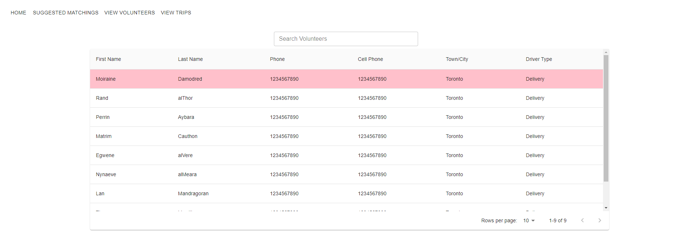
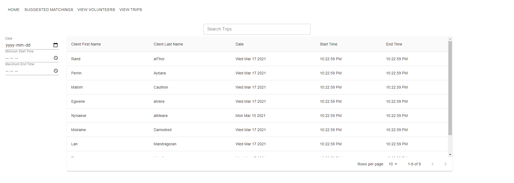

# Route301

Deployed at -> [https://routesmatchingapp.herokuapp.com/trips](https://routesmatchingapp.herokuapp.com/trips)
Bonus Desktop app can be downloaded at -> https://utoronto-my.sharepoint.com/:f:/g/personal/pawanpreet_mundi_mail_utoronto_ca/EjXm2WrwEj9Ap_qpAV3wHbQBoEo-fhXE8CeOKxY8RTT9_g?e=bfRRhT

[Phase 1 readme](https://github.com/csc301-winter-2021/team-project-9-routes-connecting-communities/blob/main/deliverables/deliverable-1/planning.md)  
[Phase 2 readme](https://github.com/csc301-winter-2021/team-project-9-routes-connecting-communities/blob/main/deliverables/deliverable-2/iteration-02-review.md)

## Description 
 * Provide a high-level description of your application and it's value from an end-user's perspective
    - Our application allows users at [Routes Connecting Communities](https://www.routescc.org/) to easily match
    volunteer drivers with clients in need of transportation, food delivery, or other related services.
 * What is the problem you're trying to solve?
    - At the moment, the workers and volunteers responsible for matching other volunteers with client trips must do
    so manually by taking into account factors such as location and preferences. Our completed product will
    significantly cut down on the time spent on determining volunteer-trip matchings via automation and will
    save money by ideally determining optimal matchings in terms of distance spent driving.
 * Is there any context required to understand **why** the application solves this problem?
    - Manually assigning every driver a ride is very labor intensive and not very efficient. Having a automated
    program do this would be much easier for the organization.


## Key Features
- Overall features
    - Our application’s main feature is finding matchings between volunteer drivers and unfulfilled client trips. Once
    these matchings have been determined, the result will be displayed in a calendar-like UI in which the user can view
    the day’s scheduled trips for each volunteer. The front-end component of this feature is implemented in the
    application’s `Suggested Matchings` tab.

- Frontend features
    - Users can lookup information about specific volunteer drivers or client trip requests via the `View Volunteers`
    or `View Trips` tabs, respectively. Each of these tabs contains a list of volunteers or trips with key information
    displayed; for a full description, users can click on an entry and view further details. Both lists are accompanied
    by filter options, such as search or filtering by date, to help the user find what they need more quickly.
    Future iterations will contain more filter options for both lists and refined page styling.
    - The `View Volunteers` tab will flag volunteer drivers that have invalid credentials; in most cases, this will be
    an expired driver’s license. These users are listed first and marked in red such that it is obvious to the user,
    and the user can click on the user’s entry to get more information about the user and issue.

- [Backend](https://github.com/csc301-winter-2021/team-project-9-routes-connecting-communities/tree/main/backend) features
    - The main functionality that the backend provides is the matching algorithm that is integral to this application.
    The core of the backend depends on a max flow algorithm located in
    [max_flow.py](https://github.com/csc301-winter-2021/team-project-9-routes-connecting-communities/blob/main/backend/max_flow.py)
    which is a variant of the [Ford-Fulkerson](https://en.wikipedia.org/wiki/Ford%E2%80%93Fulkerson_algorithm)
    algorithm that we have implemented ourselves. This algorithm is one of the most technically challenging parts of the
    backend, as we count on it's correct operation to ensure that our matchings are correctly generated.
    - Another important feature of the backend is the ability to construct [flow networks](https://en.wikipedia.org/wiki/Flow_network)
    from the rides and driver data. This functionality is implemented in
    [graph_constructor.py](https://github.com/csc301-winter-2021/team-project-9-routes-connecting-communities/blob/main/backend/graph_constructor.py),
    and allows us to construct these flow networks to find the best matchings possible. Currently, with our test data,
    the backend can output matchings in a text format like this, which is in-line with our expectations:
    ```text
    ride r2 was assigned driver d0
    ride r8 was assigned driver d0
    ride r0 was assigned driver d1
    ride r1 was assigned driver d3
    ride r3 was assigned driver d3
    ride r4 was not assigned a driver
    ride r5 was not assigned a driver
    ride r6 was not assigned a driver
    ride r7 was not assigned a driver
    ```
    - One last feature that the backend provides is the ability to convert string addresses into physical coordinates.
    This feature is implemented in
    [maps_api.py](https://github.com/csc301-winter-2021/team-project-9-routes-connecting-communities/blob/main/backend/maps_api.py)
    using the [googlemaps](https://github.com/googlemaps/google-maps-services-python) API and allows us to generate optimal
    matchings by preferentially matching drivers and rides which are closer together.


## Instructions

*	To access the application's homepage, use the following link: https://routesmatchingapp.herokuapp.com/.
    For this deliverable, there is no login required. From the homepage, you can access the three main views:
    Suggested Matchings, View Volunteers, and View Trips.
    
*	The Suggested Matchings view displays the UI for viewing the matchings generated by the application once it is
    fed appropriate data. Currently, example data has been hardcoded into the frontend to demonstrate the daily calendar view UI.
    
*	The View Volunteers view provides a list of the volunteer drivers loaded into the application.
    Currently, this list can be filtered using the search bar above the list; in future iterations, more filter options
    will be available. To view additional data regarding a specific volunteer, click on an entry in the list to redirect
    to the related information page.
    
*	The View Trips view is similar to the View Volunteers view. Instead of volunteers, unfulfilled trips are listed
    here with different filter options. Like with volunteers, clicking on an entry in the list will bring up more
    information about the specific trip.
    

*   The backend is currently not connected to the frontend. However, it is fully functional at this point and can be
    tested by running `python3 graph_constructor.py` in the `backend` directory. This will parse some sample data
    of rides and drivers and output a matching to the terminal. The matchings are working as we would expect, and our
    next step is just to connect the backend to the frontend for a easier way to display the matchings.
 
 
## Development requirements
*	Our application's frontend uses the React framework with Yarn as a package manager.
    We are assuming Node.js and the npm package manager are installed; these can be installed via the Node.js website.
    To install yarn using the NPM package manager, run the command `npm install --global yarn`.
    To install the dependencies for the project, navigate to the directory containing the `package-lock.json` file
    and use the command `yarn`. Once this is complete, a local development server can be hosted using the command `yarn start`.
 
*	As for the backend, simply `cd` into the `backend` folder and run `pip install -r requirements.txt`. This will
    install the required dependencies for the backend.

 
 ## Deployment and Github Workflow

*   For this deliverable, our project was split into two main branches: one for frontend development, and one for
    backend development. 
	When necessary, we used other branching to implement specific features that were then merged back into either
	the frontend or backend branches. 
	We found branching to be less important for the frontend part of the codebase, since we were able to assign
	every team member to a specific view in the application. 
	This resulted in very few merge conflicts, and when they occured we would notify the other team members in our
	Discord server and explain how we planned on resolving the conflict.

*   When merging on to the main branch, we first create a pull request from a branch to main. Afterwards, two people
    (one from frontend and one from backend) will review the pull request and merge it, resolving any conflicts as necessary.
    The pull requests are created when significant work is done on a branch and a stable version is reached to be committed
    to the main branch. The reason we have two people review the pull requests is to make sure that no work gets overwritten
    during a merge. Having someone from both the frontend and the backend allows us to have someone familiar with the code
    base of each team so that they can verify that all the code is intact and working as intended.
	
*   For the live demo of our application, we decided to deploy the code from our frontend branch with some dummy
    data in the place of the matchings that would be provided from the backend. We used Heroku as means for deployment
    due to ease of use and prior experience. This process involves installing the Heroku command-line
	interface and using its built-in tools along with Git to push our project to Heroku's remote repository.


 ## Licenses 

We applied the [MIT License](https://github.com/csc301-winter-2021/team-project-9-routes-connecting-communities/blob/main/LICENSE)
to our codebase. Seeing as our project is relatively simple and will only be used
internally at Routes Connecting Communities, the simple and straightforward MIT License seemed to be a good choice.
Since we originally planned on the code being completely open-source and available, this choice did not significantly
impact our development process. We also discussed the state of our codebase after completion of the project
with our partner and they have no objections to this licensing choice.
