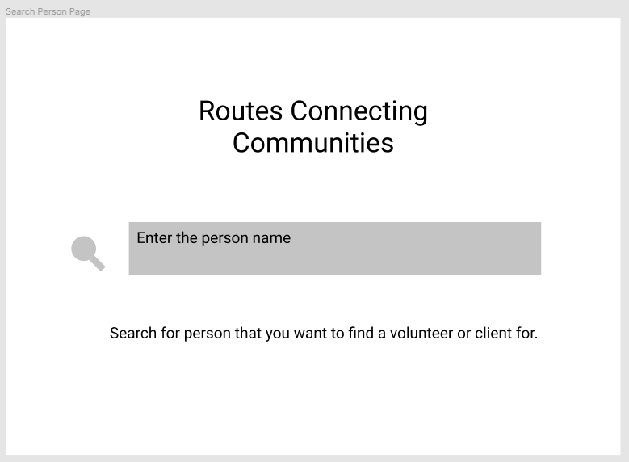
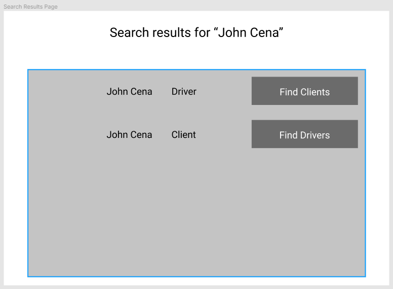
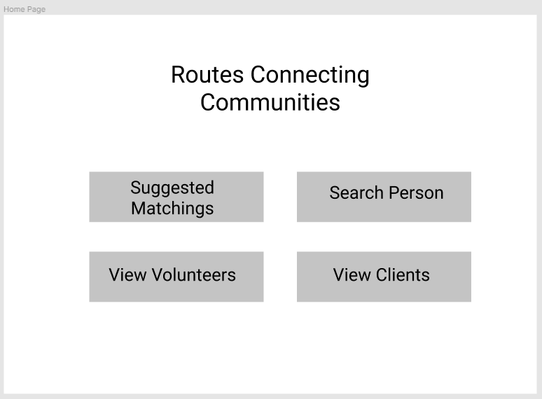
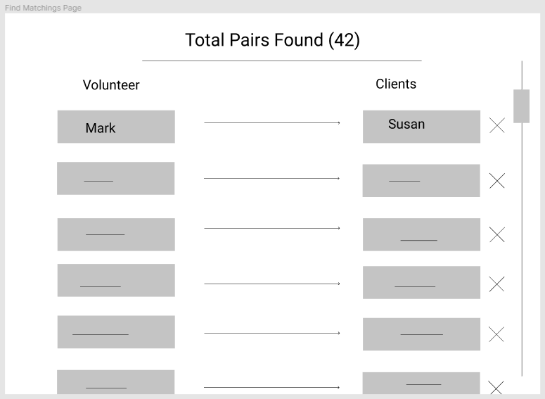
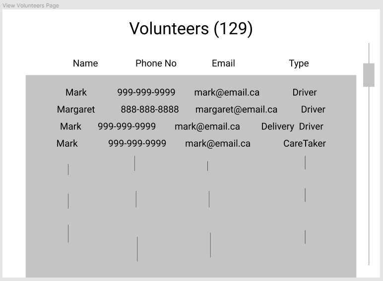
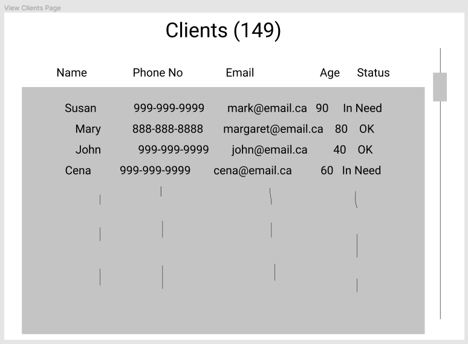

# Routes301 - Routes Connecting Communities

## Product Details
 
#### Q1: What are you planning to build?

We plan on building a web application that matches volunteer drivers with clients in need.
Routes Connecting Communities is an NGO that helps transport people in need who cannot access public transportation. They offer lower fees and tailored drivers who can provide a level of care beyond what a standard Uber ride or taxi can provide. Currently, Routes Connecting Communities manually matches up different types of drivers and contacts them; this process is time consuming and unreliable. We are going to build an application that finds reliable and convenient matchings between clients and volunteer drivers.
There will be two components to this project. The first is the backend, which will contain the tailored matching algorithms and necessary code to connect to the server if required. The second is the frontend, which will provide an intuitive interface. This front end will be in the form of a web application. Our algorithm will be based off of data provided on location, preferences, and availability times. This app will be used at the RoutesCC office. 

#### Q2: Who are your target users?

Our target users are employees and volunteer drivers at the Routes Connecting Communities office. Our users come from varying backgrounds of technical experience and desire an easy-to-use service that will provide optimal volunteer-client matchings.
The following are some examples of user personas:
* A 70 year old volunteer driver that is looking to help someone by driving them to the hospital.
* A 40 year old employee at the RoutesCC office that wants to find an available volunteer driver to take Anne to the dentist this weekend.
* A volunteer that has come to RoutesCC office and wants to find a client to chat with or spend time with and have a good time.

#### Q3: Why would your users choose your product? What are they using today to solve their problem/need?

This product is made for users that do not want to spend time guessing and searching for the right volunteer driver for a client, just to contact them and discover they are unavailable. With our application, the user can find a volunteer driver for a job that is geographically close, meets, the driver's preferences, and is flexible for the driver's schedule. The application will save the user a great deal of time, and it will parse the database of clients and drivers to find the best matching for each client.

#### Q4: How will you build it?

Our web application will need to connect to RoutesCC's database of clients and drivers using an API they provide. We will use the Google API to find the distance between two addresses, either finding them at runtime or writing a script to convert addresses to coordinates first. The latter might be more robust.
In terms of testing, our strategy will be writing test cases for the expected matchings given sample data. We will test all types of data to ensure our output matching is convenient. Much of this testing will be a feedback process where we have some test data, and the matching software would produce some matchings. We then manually inspect those matchings to ensure that it would be what a human would have chosen, and over time will tune the algorithm to match the needs of the users.

#### Q5: What are the user stories that make up the MVP?

The following is a list of our user stories and their acceptance criteria:
1. As an employee at RoutesCC, I want to automatically create an optimal set of volunteer-client matchings that respects preferences and reduces geographic distances in order to save volunteers as much time and money as possible.
	* Allow the user to specify the date for which the matchings should be made.
	* Report any outstanding errors or issues with the matchings after they have been computed (e.g. No volunteer present to match with a specific client).
	* Allow the user to manually review and edit matchings after they are computed.
	* Include a confirm button to save the matchings.
2. As an employee at RoutesCC, I want to manually view the details of any volunteer or client in order to communicate with them if needed.
	* Given that the user has navigated to the Volunteers or Clients page, depending on their search, list the relevant individuals with an option search bar and filters.
	* If a user clicks on one of the listed names or client orders, they are taken to a page with further information, including contact information and calendar.
3. As an employee at RoutesCC, I want to manually edit a set of existing volunteer-client matchings in order to create or delete matchings to satisfy any last minute or extenuating circumstances that may arise.
	* Display matchings relevant to a specific individual on their information page in either a list format or calendar formant.
	* If a user clicks on a matching, an edit and delete button will appear next to the representation of the matching.
	* If the edit button is clicked, show the matching’s details in forms on a pop-up; these forms should be mutable and allow the user to edit settings such as timing or destination.
	* If the delete button is clicked, confirm with the deletion with an additional pop-up modal.
4. As an employee at RoutesCC, I want to order destinations in a multi-destination volunteer-client matching in order to satisfy any prerequisites each destination might have (e.g. Driving to the clinic before driving to the pharmacy).
	* Given that the user is viewing the details of a specific client order, provide the option to use automatic destination ordering or custom destination ordering.
	* Show a list of the particular client order’s destinations.
	* Provide the user some means of ordering the destinations.
	* Include a confirm button to save changes made to the order.
5. As an employee at RoutesCC, I want to review volunteers’ certifications present in the database in order to ensure they are valid and up-to-date.
	* Given that the user is viewing the list of volunteers, flag those who have invalid or expired certifications (e.g. driver’s license, vulnerable sector check) and sort them first in the list.
	* The above behavior should be the default; however, provide an option in filters to stop prioritizing the flagged individuals and sort the list as normal.
----
## Intellectual Property Confidentiality Agreement 

We will not share any confidential data that we may come across in the process of this project, but we are free to post any code related to this project on public sources.

----

## Process Details

#### Q6: What are the roles & responsibilities on the team?

| Name | Strengths | Weaknesses |  Role |
|--|--|--|--|
| Pawanpreet | Java Applications, Algorithms, Python | Databases, Web Front End, DevOps | Testing, develop the matching algorithm. Will help with any task. |
| Haocheng | Python, SQL databases, unix command line | Anything web or front end related, Javascript, creative work | Algorithm design and implementation. Some scripting to get the backend and algorithm to work together. |
| Khaled | Frond end: JavaScript, React Backend: Algorithms | Databases, DevOps | Front end, Algorithm, Testing |
| Welvin | JavaScript, React, Python | UI/UX Design, Database, DevOps | Developing different components needed on the front-end part of the app, working together with other team members to come up with an efficient and reasonable matching algorithm(s) |
| Valerie | UI design, Javascript, HTML/CSS | DevOps, Backend, Testing | Front end, UI design |
| Rogan | Python, Algorithms, JavaScript | DevOps, Databases, Web Dev Backend | UI and algorithm design, meeting minutes |

#### Q7: What operational events will you have as a team?

We will have online weekly meetings. The purpose of the meetings is to get everyone's feedback and express concerns. It will also consist of discussing the progress made in the week and plans for the next week, including how much everyone will be able to contribute in the upcoming week. We will also ask our partner questions and discuss the choices to be made.  
During the previous meetings with our project partner, we discussed foundational aspects regarding to the project and their expectations with this collaboration. We also discussed in more detail some of the different functionalities of the application and specific goals our partner expects us to complete.
  
#### Q8: What artifacts will you use to self-organize?

A text file in our online repository will contain features, user stories, and associated priorities along with team members who are currently working on them. Team members are expected to update the feature document with estimations of how long it will take them to complete their work. These tasks will be assigned during our weekly team meetings based on group suggestion and personal interest.  These assignments can change overtime if more help is needed or other features are prioritized. In terms a meetings, a team member will be assigned to take meeting minutes and post them to a shared document.
Additionally, the team is using a Discord server for open communication and keeping everyone engaged and up to date. 

#### Q9: What are the rules regarding how your team works?

We will have a process of questions that we must go through in each meeting. A moderator will be picked before each meeting to lead this process.  Refer to the previous question Q8's answer for details on keeping track of individual progress.
The following are some example conflict and resolution examples.  

**Scenario**: A team member was not able to complete most of their weekly assigned work.

The team member is expected to let the team know through the team chat. If it is a busy week coming up, the team member can let the team know while we assign user stories during the meeting.

**Scenario**: A team member is not responding and did not come to the team meeting.

We expect the member to let the team know if they cannot attend the meeting or have circumstances that will not allow them to work on the project. We will be patient and understand that the team member may be going through unusual circumstances.

**Scenario**: Multiple team members want a user story, or a team member does not want to do their user story.

We will consider everyone’s strengths and preferences when assigning user stories in our team meeting. We will focus on getting things done by giving user stories to the members that are more experienced for the user story.

**Scenario**: Some team members are assigned more time consuming work than others.

This scenario can happen if a member is busy and needs a lighter load for the week. We will give more work for this team member for another week. If a team member(s) has finished their work for the week, or the member sees that another user story is more important, then they can let the team know to decide on what to work on next.

----
## Highlights

We were discussing either developing a desktop app or a web app but ultimately went with a web app. Our decision was based on the demographic of the potential users of our app. Since they are going to be older, ease of use and access is important. A web app offers cross platform compatibility easier than a desktop so we do not have to worry about different operating systems and the users can access the app from their desktop or phone.

From our discussions with the customer, we narrowed down the scope of our app to focus on the optimal matching of drivers. This is because they told us that their main problem right now is with the efficiency of the dispatch process.

----
## Mockup Screenshots

